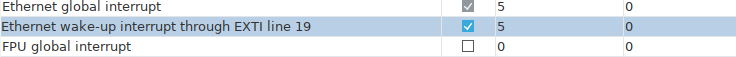

# AGV_STEERING_CONTROLLER

## DiscoveryF4RobotController

После генерации кода необходимо проверить корректность полученного кода.
* стандартный вызов функции инициализации LWIP должен быть закомментирован

_firmware/DiscoveryF4RobotController/Core/Src/main.c_

     /* init code for LWIP */
    //  MX_LWIP_Init();

### Настройка прерываний

(Pinout&Configuration -> System View -> NVIC Mode and Configuration)
* Прерывания Ethernet должны быть включены, а их приоритеты выставлены в значение 5
* Прерывание FPU должно быть выключено

